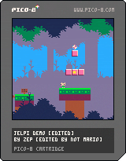

## preface
this is not [a full instruction manual for pico8](https://www.lexaloffle.com/dl/docs/pico-8_manual.html). that exists.  
this is just meant to be a basic introduction to making games in it, and some effects that are useful.  
think of it like a cookbook.  
basic familiarity with simple programming patterns is assumed.  
## the console
when you open pico-8 you will be met with this screen.  
  
this is the **console**. this is where you will switch between games, and save and load them.  
you can type *help* to open this help message. (lowercase is shown as uppercase, and uppercase is shown as various symbols)  
  
these are the commands you can use to navigate pico-8's filesystem and load games.  
you can start by running *install_demos* to install some demo games onto your system to the */demos/* folder.  
at any time, you can run *ls* to show what is in the current directory.  
  
if you run it now, all you'll see is the *demos* folder. let's go into it.
you can run *cd demos* to enter the demos folder. if you want to go back, run *cd ..* to go to the folder above you, or *cd /* to go to the root of the filesystem (you start there). 
let's see what's in the demos folder.  
  
here are some demo **.p8 files**, one way of sharing pico-8 games.  
let's give one of them a go! type *load jelpi* to load in the *jelpi.p8* file, and type *run* to run it.  
the default controls for pico-8 on a desktop computer are the arrows, z for the {O} button and x for the {X} button.  
  
try and beat the first level of jelpi. if you do, you will notice that the second level is empty! oh no! let's fix the game so it has a second level. press escape to close the game.  

## the editors
pico-8 can edit any .p8 file that you find. let's start by editing jelpi.  

press escape to open the editors! you'll see a lot of code. ignore it for now.  
  
there are several tabs up the top. at the top left, there are code tabs, for organisation. at the top right, there are the different editors. you can click on the icons to change editor.  
### the sprite editor
this one's the easiest to understand, so we'll start here. here you can edit the sprites that are used in the game. there are various tools and colours to use. there are also some tabs 0-3 above the array of sprites, to view different sprite banks.  
banks 2 and 3 may look a bit odd, however this is because the second half of the sprite editor and the second half of the map editor (coming later) share the same memory meaning only one can be used at a time.  
try editing some of the sprites! in this game, black is used as the transparent colour. when you make your own game, you can pick your own colour to act as transparent.  
  
### the map editor
here you can edit the game's map. some games won't use this, but it is invaluable in others.  
you can use the arrow keys to scroll the view to see other parts.  
in jelpi, level 2 is stored directly below level 1. try building a level!  
  
### the code editor
in the code editor, you can program the game.  
there's one thing we'll have to do before you can test your new level. go back to the first tab, and change `level=1` in the code to `level=2`. now play your new level! if you want to improve it, do so.
if you want to change the sign's message, scroll down in the code editor and change the value of `sign_str`.
  
## sharing
let's save your game, then share it as a **.p8.png** cartridge.  
before you share it, remember to reset `level=1`, or don't, if you want players to start directly at your new level.  
  
now let's go back to the root folder by running *cd /*.  
to save your new cartridge, run *save filename*, where filename is the filename you want to save it with. this will save it as *filename.p8* in the root directory.  
let's open the folder! run *folder* to open it in your operating system's file manager. you can share the .p8 file, but...  
run *export filename.p8.png*. this will save it as a shareable, playable, p8 file. to change the icon for it, press *ctrl+shift+7* in game. to change the text, edit the first two lines in the code editor.  
to load a p8.png, copy it into your pico-8 folder, then type *load filename*.
here is the finished example cartridge, following these instructions.  
  
(you can save and run this!)

## making your own games
now to learn the basics of game development. first, type *reboot* to reload the pico-8 and clear out the old game.  
now, let's press *escape* to open the code editor.  
### structure of a pico-8 game
there are three functions which are part of a pico-8 game. **\_init**, **\_update**, and **\_draw**.  
the **\_init** function is called when the game starts, so it is used to set the initial state of the game.  
the **\_update** function is called once every frame. this is useful for the logic of the game.  
the **\_draw** function is also called once every frame... however if the game is lagging, the draw function will wait, whereas the update function will keep running, resulting in low FPS, but the same gameplay.  

let's start by going into the sprite editor and drawing a player sprite. you can use any sprite slot, but I will use sprite slot 001.  
  
now let's go back into the code editor and type out our three functions.  
  
in this demo game, we'll have a player that can move around a 2D world with two screens.  
to start, let's create some variables to store the player's position, and draw them in onto the screen using the **spr** command.  
the screen of the pico-8 is 128x128 px large.  
  
  
there it is! our player! but you may notice that the "run" text is still on screen.  
this is because pico-8 **does not clear the screen by default**. let's add that in now by creating a map.  
draw in some sprites for grass and a wall, and place them into your map editor, in a 16x16 grid of tiles.  
now, just by calling the **map** function in our draw step, you can have your map rendered to the screen!  
  
  
  
this is great! now let's get the player moving.  
### inputs
let's write out our **\_update** function now.  
you can check for player input by using the **btn** function in the update step. it takes two arguments, but the second one is optional.  
(you can write out direction symbols, and the X and O buttons by typing shift+L/R/U/D/X/O)  
  
  
that's great! but we have one issue. the player can walk through walls. we haven't stopped them from doing so. let's do so now, using sprite flags.  
to start, go back to the sprite editor to your wall sprite, and click on one of the eight circular buttons to set a flag we can check for in code.  
  
now, let's write a function to check sprite flags (as doing it manually would be quite repetitive)  
### helper function
in this function, we'll use the **mget** and **fget** functions to get the contents of the map at a position, and if it has a certain flag set.  
  
  
(the offsets are different due to the player being drawn at the top left corner)

alright! your player should now be stopped by walls!  
now, let's add a second screen.

### moving the camera
start by drawing a collectible sprite (with its own flag) and creating a 16x16 screen to the right of your current one involving it. include an entryway to it on your first screen.  
  
  
brilliant! let's test out our new screen by walking to the right and... oh.  
we need to manually move the camera to the right when the player reaches the second screen.  
go back to the **\_draw** function in your code editor, and add this code snippet to it.  
